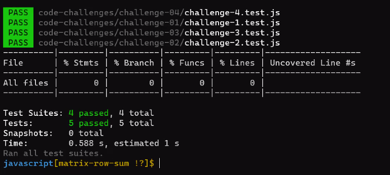

# Matrix_Row_Sum
write a function to add up the sum of each row in a matrix of arbitrary size, and return an array with the appropriate values.
Avoid utilizing any of the built-in methods available to your language.
Example : 
                  
	
  >Input  [ [1, 2, 3], [3, 5, 7], [1, 7, 10] ]  
   Output  [6, 15, 18]

 >Input  [ [0, 1, 5], [-4, 7, 2], [-3, 12, 11] ] 
  Output	 [6, 5, 20]

## Test Result

## Whiteboard Process

