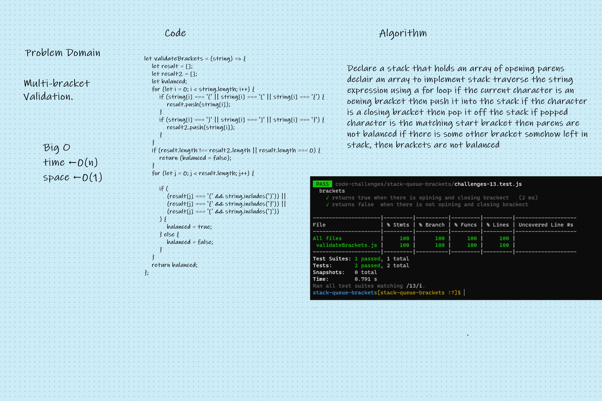

# Stacks Queues Brackets

<!-- Description of the challenge -->

Multi-bracket Validation.

## Whiteboard Process

<!-- Embedded whiteboard image -->

## Approach & Efficiency

<!-- What approach did you take? Discuss Why. What is the Big O space/time for this approach? -->

Your function should take a string as its only argument, and should return a boolean representing whether or not the brackets in the string are balanced. There are 3 types of brackets:
Round Brackets : ()
Square Brackets : []
Curly Brackets : {}