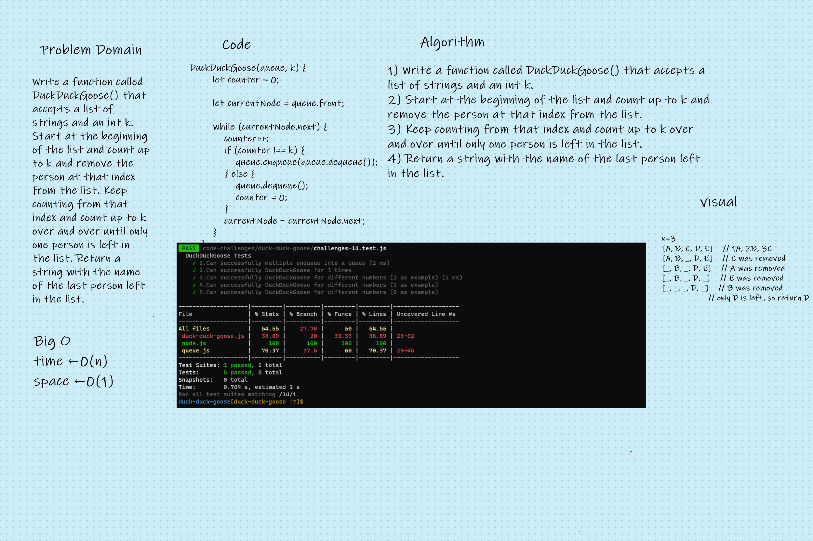

# Duck Duck Goose

<!-- Description of the challenge -->

Write a function called DuckDuckGoose() that accepts a list of strings and an int k. Start at the beginning of the list and count up to k and remove the person at that index from the list. Keep counting from that index and count up to k over and over until only one person is left in the list. Return a string with the name of the last person left in the list.

## Whiteboard Process

<!-- Embedded whiteboard image -->

## Approach & Efficiency

<!-- What approach did you take? Discuss Why. What is the Big O space/time for this approach? -->

understood the problem first
I imagined how the results should be
I wrote the code
I made the tests
space : O(1)
time : O(n \* k)
after all it was taken almost 2 hour just to handel the whit bord .