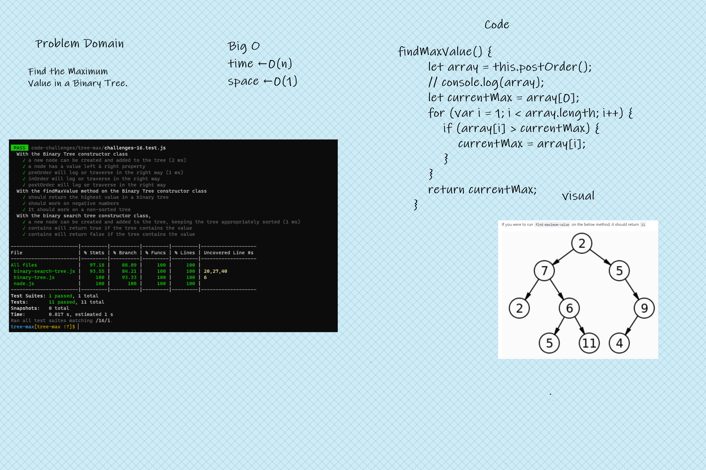

# Tree Max

<!-- Description of the challenge -->

Find the Maximum Value in a Binary Tree.

## Whiteboard Process

<!-- Embedded whiteboard image -->

## Approach & Efficiency

<!-- What approach did you take? Discuss Why. What is the Big O space/time for this approach? -->

- Utilize one of the DFS traversal methods already created in the class
- Establish a variable called 'currentMax' that takes the first item in the array
- Loop over the array; initialize i at 1
- Use a Boolean to compare array[i] to the currentMax
- if array[i] is greater than currentMax, reassign currentMax to array[i]
- return currentMax