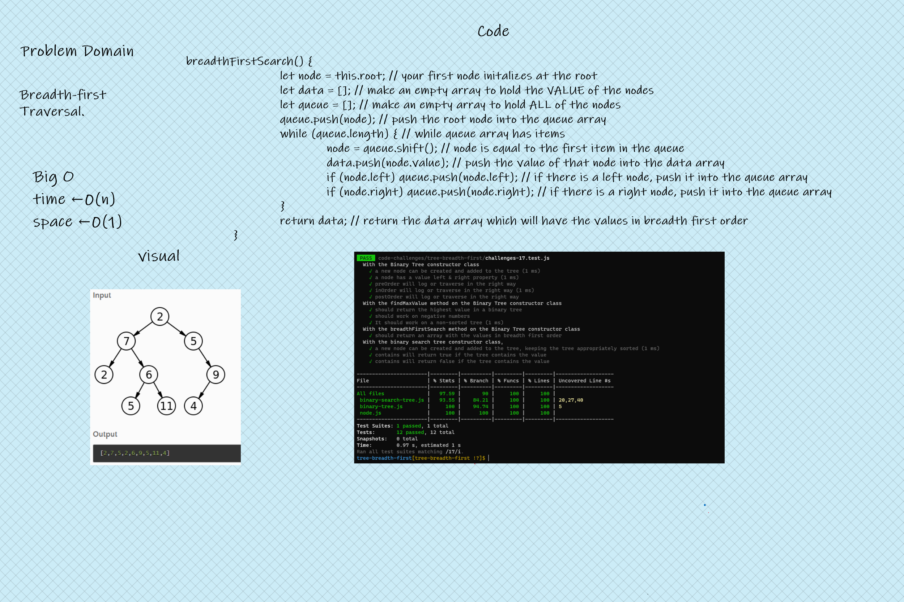

# Tree Breadth First

<!-- Description of the challenge -->

Write a function called breadth first

Arguments: tree

Return: list of all values in the tree, in the order they were encountered

## Whiteboard Process

<!-- Embedded whiteboard image -->

## Approach & Efficiency

<!-- What approach did you take? Discuss Why. What is the Big O space/time for this approach? -->

- Start at the root
- Have an array for the values and a staging array that has all the nodes
- Interative Method: use a while loop that loops while there are still nodes in the queue array
- Take the first node from the queue array, and push it's value into the data array
- check all lefts & rights before going further down