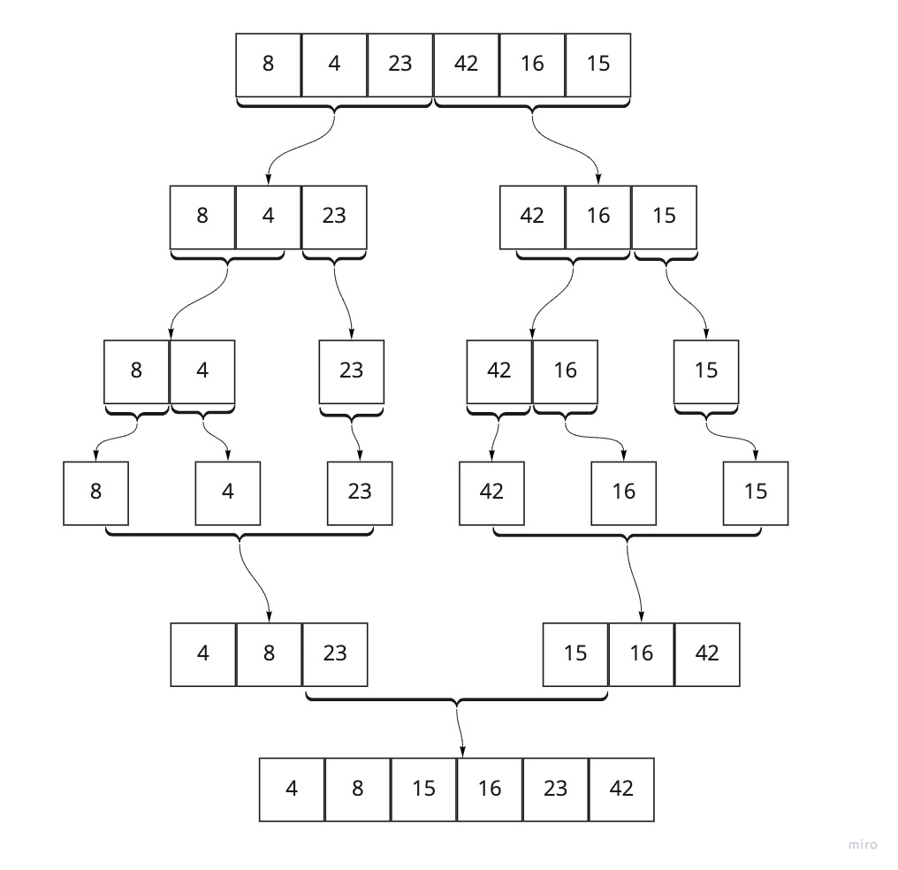

# Merge Sort

Merge sort is a method to sort arrays in programming. Merge sort is known as a divide-and-conquer algorithm, in that you divide an input array into two halves, sort the halves, and then merge them together with a helper function. Merge Sort recursively calls itself until you're essentially left with each value from an array as a stand alonge value. These values are then merged back together with the helper function.

The following is pseudocode for the merge sort method:

## Pseudocode

```js
ALGORITHM Mergesort(arr)
    DECLARE n <-- arr.length

    if n > 1
      DECLARE mid <-- n/2
      DECLARE left <-- arr[0...mid]
      DECLARE right <-- arr[mid...n]
      // sort the left side
      Mergesort(left)
      // sort the right side
      Mergesort(right)
      // merge the sorted left and right sides together
      Merge(left, right, arr)

ALGORITHM Merge(left, right, arr)
    DECLARE i <-- 0
    DECLARE j <-- 0
    DECLARE k <-- 0

    while i < left.length && j < right.length
        if left[i] <= right[j]
            arr[k] <-- left[i]
            i <-- i + 1
        else
            arr[k] <-- right[j]
            j <-- j + 1

        k <-- k + 1

    if i = left.length
       set remaining entries in arr to remaining values in right
    else
       set remaining entries in arr to remaining values in left
```

## Trace

On the first pass, the initial array is split into half, creating a left and right array. These are then recursively called on again until each value of the initial array is basically a stand alone array with a single value.

The values are then passed into the merge helper function. This function compares values one by one until the left and the right array are equal to the counter `i`. If the current value of the left array is less than the current value of the right array, `arr[k]` receives the value from the left array; otherwise `arr[k]` receives the value from the right array. This continues on until all of the values are pushed back into the original array.

Input Array: `[8, 4, 23, 42, 16, 15]`

console.log
[ 8 ]

console.log
[ 4 ]

console.log
[ 23 ]

console.log
[ 4, 23 ]

console.log
[ 4, 8, 23 ]

console.log
[ 42 ]

console.log
[ 16 ]

console.log
[ 15 ]

console.log
[ 15, 16 ]

console.log
[ 15, 16, 42 ]

console.log
[ 4, 8, 15, 16, 23, 42 ]

console.log
[ 4, 8, 15, 16, 23, 42 ]

## Visual output the console log

This is a visual diagram of how the divide and conquer method works:

Input Array: `[8, 4, 23, 42, 16, 15]`

